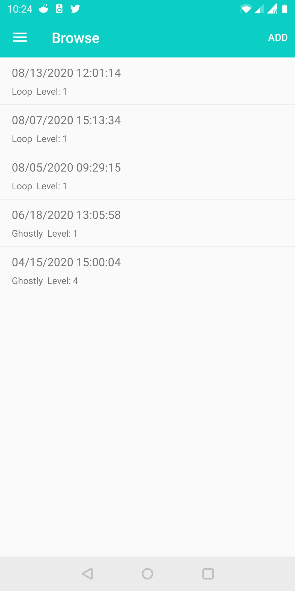
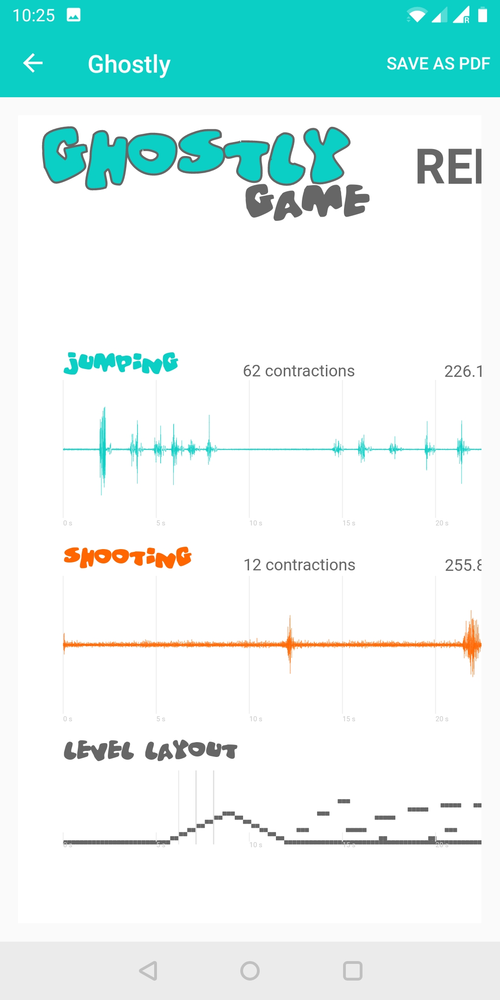

OpenFeasyo Log
==============

The OpenFeasyo Log application provides an overview of gaming sessions (only for OpenFeasyo games). The application reads the stored gaming logs (stored in the .c3d file format) and generates a gaming report containing the details about the gaming session like time, date, level details as well as visualization of the sensory data (e.g. EMG plots).

Quick Start Guide
-----------------

After opening the application the user sees a list of gaming sessions played on the device. The list is sorted chronologically, the most recent logs are on the top.

In case the list is empty, it means there are no data stored on device (no games were played).

