Loop game
============

Loop is a racing game inspired by runner arcade games positioned in a tube. The 3D feel emphasizes the speed and anticipation of obstacles. The goal is to collect as many points - stars as possible while avoiding the obstacles – bombs. The game becomes progressively more difficult as more bombs stand in the way. You can have at the most two collisions (three lives), game over afterwards.

The Loop game was developed by Prof. Bart Jansen and his team - Lubos Omelina and Katarina Kostkova from ETRO Department of the Vrije Universiteit Brussel and in collaboration with Prof. Eva Swinnen, specialist in rehabilitation sciences and Dr. Armand Laumen, pediatric orthopedic surgeon.

Quick Start Guide
-----------------

**Sensor Placement**

1) Turn on your sEMG sensors and do all necessary setup.

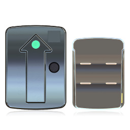

2) Place the sensors on the muscles

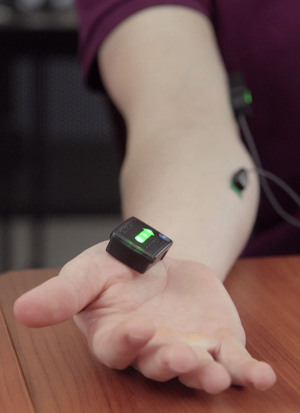

**Settings & Calibration**

3) Start the Ghostly Game.

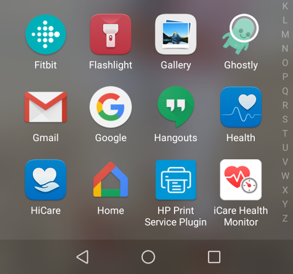

4) Choose EMG as a way to control the game. In case you want to control the game via touch, select TOUCH and continue with step 10

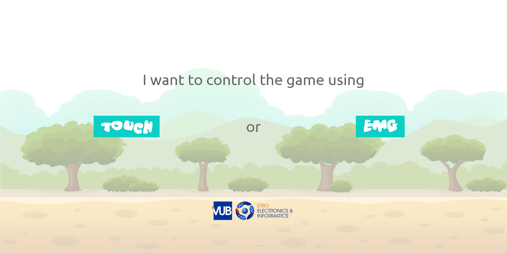

5) Wait while the application is scanning for the sensors.

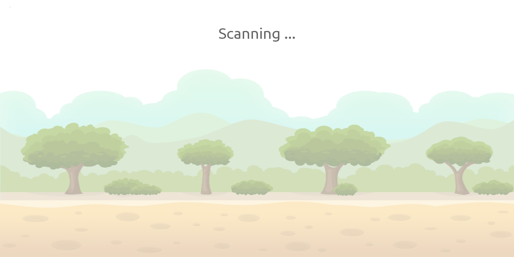

6) Choose which sensor controls jumping, by clicking on the sensor name.

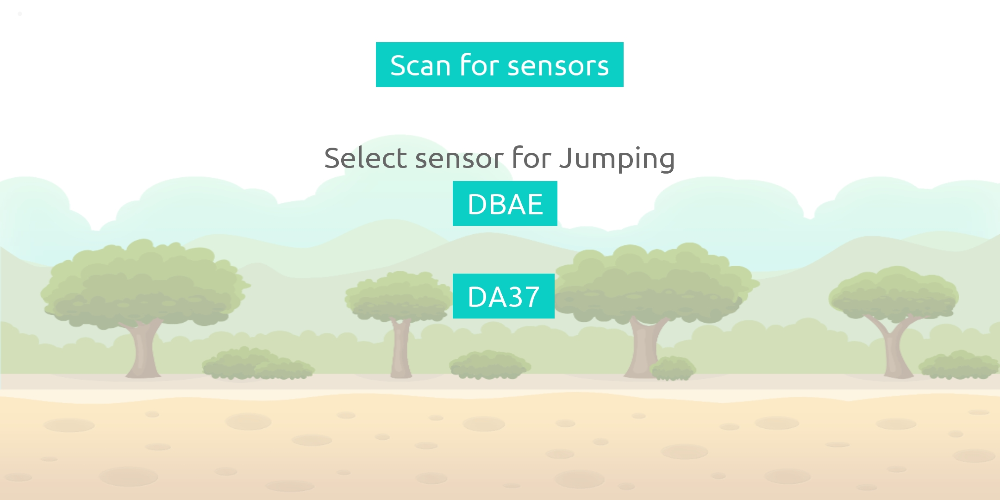

7) Choose which sensor controls shooting, by clicking on the sensor name.

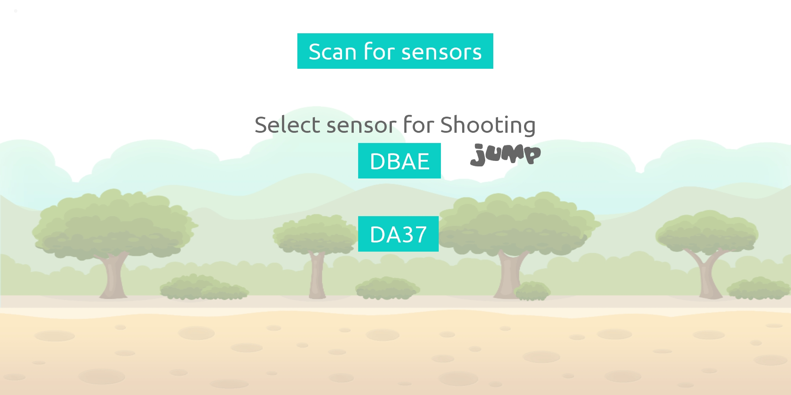

8) After choosing which sensor controls what action, tap on the "CONNECT" button.

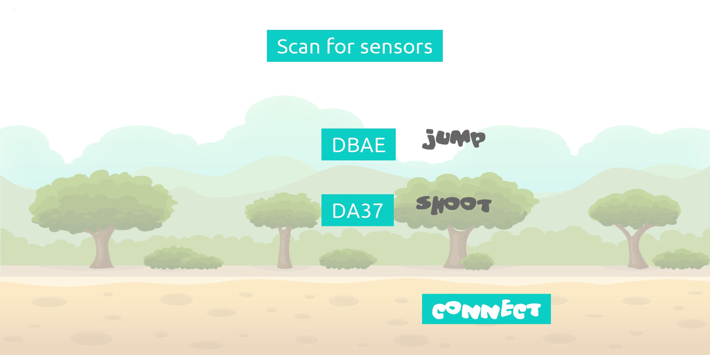

**Level Selection & Play**

9) Start the sensor calibration by clicking on the button 'Start Calibration'. You need to relax your muscles during the calibration.

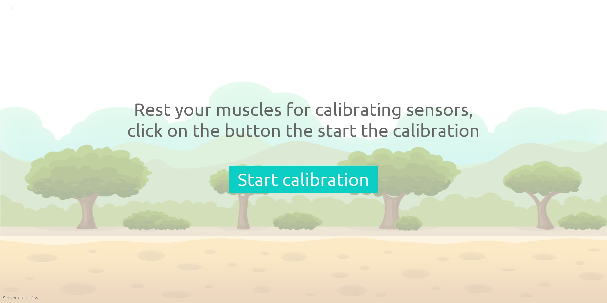

10) To start the game, click on "START GAME" button.

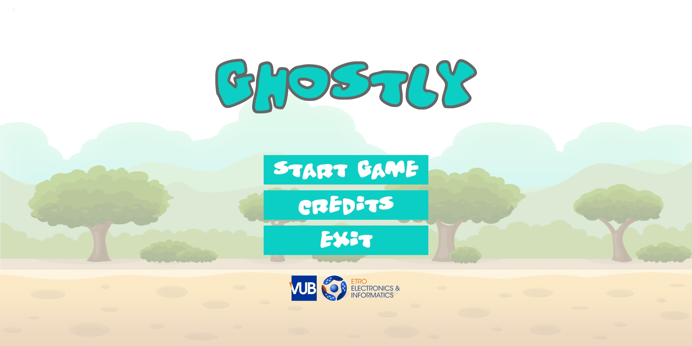

11) Choose world you want to enter by clicking on it's name - Earth, Water, or Rock.

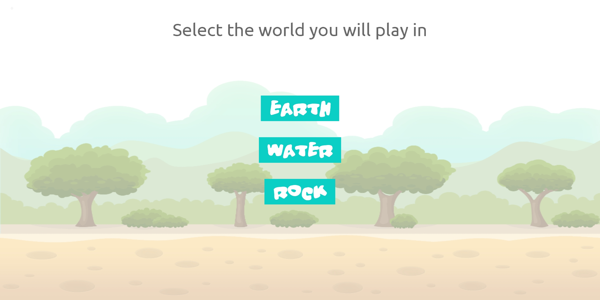

12) Choose the level you want to play.

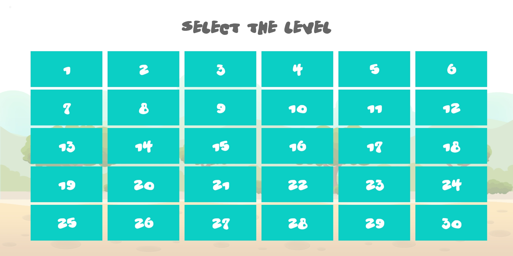

13) Enjoy playing the game

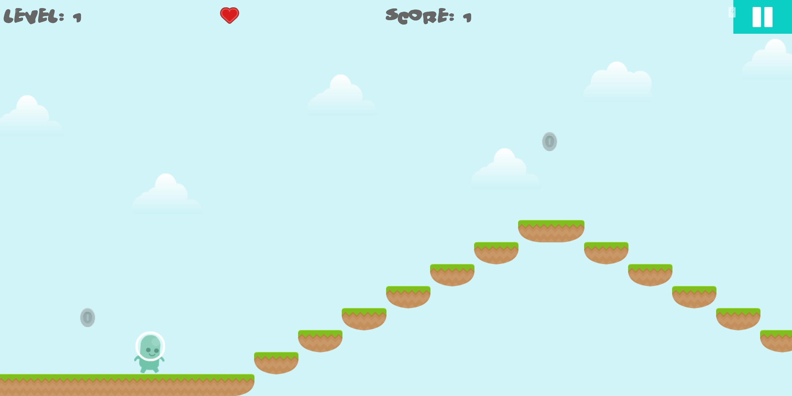

**Game Data Browsing**

14) Start the "Ghostly Log" application.

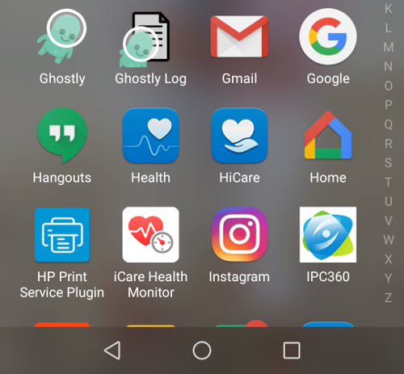

15) Browse the recorded files.

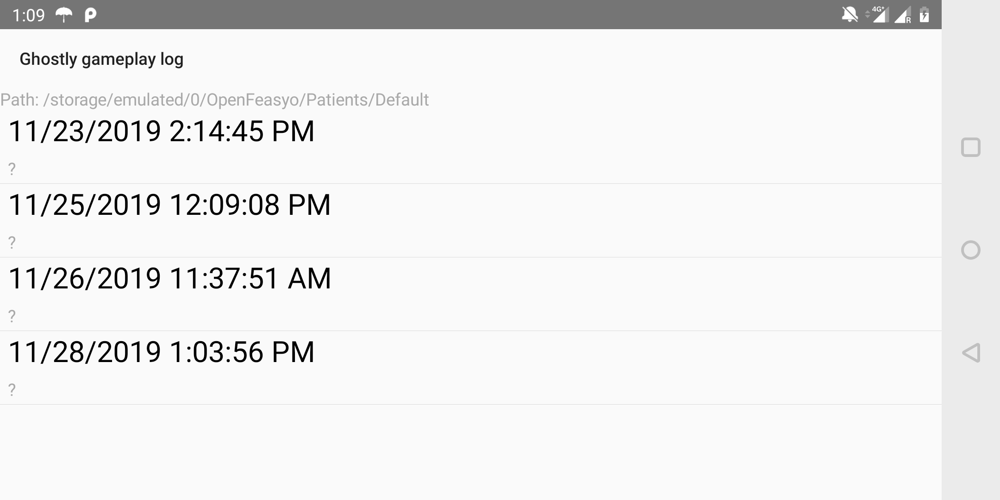